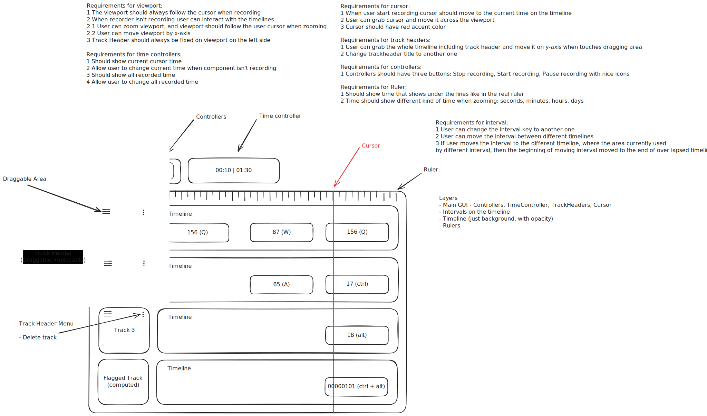

<p align="center">
  
</p>

<h1 align="center">KKISE</h1>

<p align="center">
  <strong>Keyboard Key Interval Sequence Editor</strong><br>
  <i>Редактор последовательностей интервалов нажатий клавиатуры</i>
</p>

<p align="center">
  
  
</p>

---

<figure align="center">
  
  <figcaption>Design draft</figcaption>
</figure>


---

## Обзор / Overview

**KKISE** — это инструмент для записи нажатий клавиш и последующего редактирования временных интервалов между ними. Позволяет создавать точные макросы и последовательности для автоматизации.

**KKISE** is a tool for recording keyboard input and fine-tuning the time intervals between key presses. It allows you to create precise macros and sequences for automation.

---

## Особенности / Features

- **Recording:** Запись ввода в реальном времени.
- **Precision Editing:** Изменение задержек (ms) между любыми нажатиями.
- **Sequence Management:** Сохранение и загрузка созданных последовательностей.
- **Visual Editor:** Удобный интерфейс для работы с таймлайном.

---

## Быстрый старт / Quick Start

### Требования / Requirements

- NVM

### Установка / Installation

```bash
# Клонируйте репозиторий / Clone repository
git clone https://git.office.plyask.in/wennerryle/KKISE

# Установите зависимости / Install dependencies
nvm install
nvm use
npm i
```